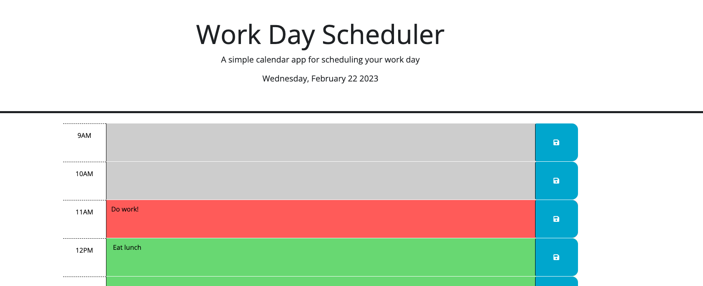

# 05 Third-Party APIs: Work Day Scheduler

## Description 
The purpose of this assignment was to create a simple work - day calendar which leveraged the dayjs API and jQuery. 

Key functionality of this calendar included: 
- Real time visualization of which hour was present, past, and future. 
- Entries that could be entered and saved into the appropriate time slot. Local storage would be used 
- Entries that would persist if the page was reloaded

## Technologies

HTML
CSS
JQuery
DayJS

[Link](https://hiclarence.github.io/work-day-scheduler/)